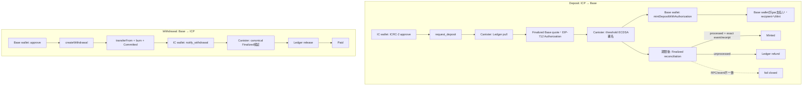

# KINIC–Base Bridge フロー

この文書は現在のICP・Base間フローを、利用者、UI、Canister、外部チェーンの境界から説明する。詳細は[Base Interface](base-interface.md)、[Canister状態機械](canister-state-machine.md)、[Operations runbook](runbooks/operations.md)を参照する。

## コンポーネント

| コンポーネント | 役割 |
|---|---|
| IC wallet | ICRC-2 approve、`request_deposit`、`notify_withdrawal`、手動reconciliation |
| Base wallet | Mint Authorization送信時のgas支払い、Withdrawalのapprove・burn transaction |
| Bridge Canister | SQLite schema v25、Ledger操作、EIP-712署名、Finalized照合、Governance transaction |
| Ledger / Index | Deposit pull、refund、Withdrawal release、履歴照合 |
| EVM RPC Canister | provider quorumによるcanonical Finalized観測 |
| Base Bridge / bSNS | 署名検証付きDeposit mint、atomic Withdrawal burn |
| Browser UI | runtime・Authorization検証、Base transaction送信、状態表示 |

## 全体フロー

## Deposit

1. UIはIC wallet、Base recipient、Bridge runtime、Finalized Base snapshot、Service Fee、Ledger残高・allowanceを再検証する。
2. IC walletが`request_deposit`を呼ぶ。Canisterは固定funding identityを保存してICRC-2 pullを行う。確定失敗では正式Depositを作らず、結果不明はReconciliation Holdへ入れる。
3. pull確定後、CanisterはFinalized Base snapshotからquote、2時間の固定TTL（変更時は公開設定と文書を同期）、Authorization epoch、EIP-712 domainとdigestを一度だけ決定する。
4. Canisterは同じdigestへthreshold ECDSA署名する。署名再試行でpayloadやdeadlineを変更しない。署名不能のままBase Finalized timestampがdeadlineを超えた場合は、期限切れのため新たに署名せずexpiry reconciliationへ進める。
5. UIは`AuthorizationAvailable`をpollし、chain ID、runtime hash、contract、pause、epoch、未処理Deposit、EIP-712 domain、全field、digest、復元signer、最新Base timestampを検証する。
6. ユーザーが`Mint on Base`を押すと、接続Base walletが`mintDepositWithAuthorization`を送る。gas支払walletとrecipientは同一でなくてよい。transaction hashはdeployment-scoped localStorageへ保存するが、Canisterの安全判定には使わない。
7. deadlineまでは同じAuthorizationで再試行できる。Base receiptがrevertした場合はpending hashを削除し、deadline内かつ未処理なら再送できる。
8. deadline後、CanisterはBase Finalized timestampがdeadlineを超えるまで待つ。`timestamp == deadline`ではContractがMintを受理できるため返金しない。
9. `isDepositProcessed == false`なら、canonical Finalized未処理証拠を保存してLedger refundへ進む。`true`ならexact `DepositMinted` eventとcanonical receiptを検証・保存して`Minted`へ進む。
10. RPC不一致、Finalized停止、runtime不一致、processedなのにevent欠落・複数・digest不一致では返金しない。後者は新規Depositをpauseして監査対象にする。

ブラウザを閉じてもAuthorization期限後の照合とrefundはCanister jobが進める。`continue_deposit`の手動操作はjobを早く起こせるだけで、deadlineとFinalized証拠を迂回できない。

## Withdrawal

1. UIはBase wallet、送付先IC Account、Service Fee、bSNS残高、chain/runtimeを再検証し、必要額をBridgeへapproveする。
2. Base walletが`createWithdrawal`を送る。Contractは同じtransactionで`transferFrom`、burn、固定quoteを持つ`Committed` record、`WithdrawalCommitted` eventを原子的に作る。
3. UIはtransaction hashをlocalStorageへ保存し、Finalized receiptを検出した後にIC walletから`notify_withdrawal`を呼ぶ。
4. Canisterはreceipt、event、Withdrawal state、Bridge snapshotを同じcanonical Finalized block hashへ束縛してquorum検証する。
5. 検証後、固定`amountOut`をLedgerで送る。結果不明はReconciliation Holdへ入り、Ledger・Indexの完全な不存在証拠なしに別identityを送らない。

WithdrawalにCanister発Base transaction、Base refund、release acknowledgement、cancelは存在しない。

## 費用と運用レーン

- Deposit Mint gas: transactionを送るBase walletが支払う。CanisterやMint SignerのETH reserveは不要。
- Governance gas: CanisterのGovernance Operatorが支払う。専用ETH floor、nonce、rebroadcast、上限付きfee bumpを維持する。
- IC処理: threshold署名、RPC、Ledger、job実行にcyclesが必要なためcycles floorを維持する。

## 公開フロー

- Deposit: `get_next_deposit_sequence` → `request_deposit` → `get_deposit_by_owner_sequence` → Base `mintDepositWithAuthorization` → 期限後自動照合
- Deposit手動復旧: `continue_deposit`
- Withdrawal: Base `approve` → `createWithdrawal` → `notify_withdrawal` → 必要に応じて`continue_withdrawal`
- 状態照会: `get_deposit`、`get_withdrawal`、`get_bridge_status`
