# KINIC–Base Bridge flows

This document explains current ICP/Base flows across the boundaries between users, UI, Canister, and external chains. See the [Base interface](base-interface.md), [Canister state machine](canister-state-machine.md), and [operations runbook](runbooks/operations.md) for details.

## Components

| Component | Responsibility |
|---|---|
| IC wallet | ICRC-2 approve, `request_deposit`, `request_deposit_refund` |
| Base wallet | Pay gas for Mint Authorization submission; approve and submit Withdrawal burns |
| Bridge Canister | SQLite schema v36, Ledger operations, EIP-712 signing, Finalized reconciliation, Governance transaction signing |
| Ledger / Index | Deposit pulls, refunds, Withdrawal releases, history reconciliation |
| EVM RPC Canister | Canonical Finalized observations through provider quorum |
| Base Bridge / bSNS | Signature-verified Deposit minting and atomic Withdrawal burns |
| Browser UI | Runtime/Authorization validation, Base transaction submission, Withdrawal notification and one-step continuation through browser identity, status display |

## Overall flow

```mermaid
flowchart TB
  subgraph Deposit["Deposit: ICP → Base"]
    D1["IC wallet: ICRC-2 approve"] --> D2["request_deposit"]
    D2 --> D3["Canister: Ledger pull"]
    D3 --> D4["Finalized Base quote / EIP-712 Authorization"]
    D4 --> D5["Canister: threshold ECDSA signing"]
    D5 --> D6["Base wallet: mintDepositWithAuthorization"]
    D6 --> D7["Base wallet pays gas; mint to recipient"]
    D7 --> D8["UI: integrate Finalized DepositMinted"]
    D5 --> D9["Finalized timestamp exceeds deadline"]
    D9 --> D10["Canister: release reservation locally only"]
    D10 --> D11["RefundAvailable"]
    D11 -->|"non-anonymous caller: request_deposit_refund"| D12["canonical Finalized reconciliation"]
    D12 -->|"processed + exact event/receipt"| D13["Minted"]
    D12 -->|"unprocessed"| D14["Ledger refund"]
    D12 -.->|"RPC/event disagreement"| D15["fail closed"]
  end

  subgraph Withdrawal["Withdrawal: Base → ICP"]
    W1["Base wallet: approve"] --> W2["createWithdrawal"]
    W2 --> W3["transferFrom + burn + Committed"]
    W3 --> W4["Browser notification Identity: notify_withdrawal"]
    W4 --> W5["Canister: canonical Finalized validation"]
    W5 --> W6["Save ReleasePending"]
    W6 -->|"UI: continue_withdrawal once"| W7["One Ledger release or reconciliation step"]
    W7 --> W8["Paid or awaiting explicit continuation"]
  end
```

## Deposit

1. The UI revalidates the IC wallet, Base recipient, Bridge runtime, Finalized Base snapshot, Service Fee, and Ledger balance/allowance.
2. The IC wallet calls `request_deposit`. The Canister saves the fixed funding identity in `Prepared`, consumes Deposit quota, and checks the active reservation and cycle reserve. After persisting `Dispatched`, it performs the ICRC-2 pull. Only success or `Duplicate` permits paid Base preflight; a failed preflight still exposes the funded record for settlement or refund. Definitive Ledger failure removes the attempt and reservation and returns quota only in its original window, without creating a formal Deposit. Unknown results enter Reconciliation Hold.
3. After pull confirmation, the Canister fixes the quote and Authorization epoch from a Finalized Base snapshot, determining the EIP-712 domain and digest exactly once with a deadline 900 seconds after `issued_at_timestamp` in IC consensus time.
4. The Canister threshold-ECDSA-signs the same digest. Only if at least 300 seconds remain at signature installation does it finalize the Bridge Service Fee exactly once and credit the fee reserve in the same transaction as signature storage. Signing retries change neither payload nor deadline; definitive failure before Authorization issuance or due to insufficient remaining time does not accrue a Service Fee.
5. The UI polls `AuthorizationAvailable` and verifies chain ID, runtime hash, contract, pause, epoch, unprocessed Deposit state, EIP-712 domain, all fields, digest, recovered signer, and latest Base timestamp.
6. For a Deposit started in this view, after validating `AuthorizationAvailable`, automatically open the `mintDepositWithAuthorization` approval prompt once if the connected Base wallet matches the original recipient. If rejected or unsuccessful, retry through `Mint on Base`. Manual submission may use a gas-paying wallet different from the recipient. Save the transaction hash in deployment-scoped localStorage.
7. After Base submission, the UI tracks the receipt and `DepositMinted` event through `Submitted`, `Confirmed`, and `Finalized`. A successful receipt completes the Bridge to Base modal, which the user may close. Finalized confirmation continues in History. Before finality show `Mint submitted`; show `Minted on Base (finalized)` only for canonical success matching the exact digest, recipient, gross amount, Service Fee, and mint amount. No IC wallet signature is required on success. After reload, restore the merged Canister Deposit and Finalized Base log by Deposit ID.
8. Retry with the same Authorization while the latest Base timestamp has not exceeded the deadline. If the Base receipt reverts, remove the pending hash; resubmission is allowed within this submission boundary if still unprocessed.
9. When a Base Finalized snapshot obtained by a new Deposit or another operation exceeds the deadline, the Canister scans a bounded deadline-ordered index and releases mint reservations without per-Deposit Base reconciliation. Do not release at `timestamp == deadline`, when the contract can still accept a mint. Conservatively overcount reservations while backlog remains; return a retryable error if new admission cannot be evaluated accurately. There are no per-Deposit timers.
10. Refunds advance only when any non-anonymous Principal explicitly calls `request_deposit_refund(deposit_id)`. Callers cannot specify recipient, amount, or transfer identity; all come from the existing record. Before Authorization issuance, `RefundAvailable` refunds without a Base outcall. After issuance, verify expiry and `isDepositProcessed` at the same canonical Finalized block: refund if unprocessed, or save the exact event/receipt and enter `Minted` if processed. RPC disagreement, missing/multiple events, or digest mismatch must not move funds.
11. Refund amounts are `gross - refund ledger fee` before Authorization issuance and `gross - charged service fee - refund ledger fee` afterward. The initial ICRC-2 pull fee, finalized Service Fee, and refund transfer fee are not returned. Save ambiguous Ledger outcomes in `RefundReconciliationHold` with the same transfer identity; a renewed claim from any non-anonymous caller resumes reconciliation.

## Withdrawal

1. The UI revalidates the Base wallet, destination IC Account, Service Fee, bSNS balance, and chain/runtime, then approves the required amount to the Bridge.
2. The Base wallet submits `createWithdrawal`. In one transaction, the contract atomically performs `transferFrom`, burn, creation of a `Committed` record with a fixed quote, and emission of `WithdrawalCommitted`.
3. The UI saves the transaction hash and notification attempt state in v7 localStorage format, automatically calling `notify_withdrawal` from a deployment-scoped browser identity only on the first detection of a Finalized receipt. Retry disconnection or `Busy` once after five seconds; allow one additional `TransactionNotConfirmed` retry only after the browser Finalized head advances. Other retryable failures require explicit `Retry IC notification` in Progress or History. No IC wallet confirmation or ICRC-21 consent is requested.
4. `notify_withdrawal` obtains each provider's Finalized block number/hash as an individual observation, accepting only a checkpoint with exact 2-of-3 agreement on the same number and hash. Verify the receipt block is at or before the checkpoint and its canonical hash matches, binding Withdrawal state, Bridge snapshot, and signer/runtime checks to that checkpoint. Stop with `RpcUnavailable` if fewer than two providers succeed, `TransactionNotConfirmed` if the checkpoint precedes the receipt, or `RpcInconsistent` if numbers or hashes disagree.
5. After validation, the Canister only saves the fixed `amountOut`, recipient, and transfer identity as `ReleasePending`; it does not call the Ledger. On notification success, the UI calls `continue_withdrawal` once with the same browser identity.
6. Each continuation advances at most one external Ledger transfer or history reconciliation step. For a nonterminal result, show `Continue payout` in History without automatic repetition. Even after complete proof of absence and saving a new identity, transfer occurs only on the next explicit call.
7. Base events and Canister stable records are authoritative, allowing restoration through History after closing the browser. Another non-anonymous identity can resume even if the browser identity is lost. Preserve liabilities indefinitely until Paid; prohibit recipient/amount changes, cancellation, and reissuance on Base.

Withdrawals have no Canister-originated Base transaction, Base refund, release acknowledgement, or cancellation.

## Costs and operational lanes

- Deposit mint gas: paid by the Base wallet submitting the transaction. No Canister or Mint Signer ETH reserve is needed.
- Base administration gas: paid by the Canister's Governance Operator, Runtime Administrator, or Independent Canceller according to transaction type. The Canister only signs; an external CLI broadcasts and notifies confirmation. Maintain independent ETH balances and nonce lanes per role; re-sign only explicit replacements within the cap.
- IC processing: maintain the cycles floor because threshold signing, RPC, Ledger calls, and job execution consume cycles.

## Public flows

- Deposit: `get_next_deposit_sequence` → `request_deposit` → `get_deposit_by_owner_sequence` → Base `mintDepositWithAuthorization`
- Deposit refund: `request_deposit_refund`
- Withdrawal: Base `approve` → `createWithdrawal` → `notify_withdrawal` → `continue_withdrawal` as needed
- Status queries: `get_deposit`, `get_withdrawal`, `get_bridge_status`

## Refundability and recipients before signing

Before a new Deposit's Ledger pull, exclude the fixed Bridge address and the BSNS address from the verified activation attestation as recipients. Stop if required bindings are missing. Continue reconciliation of funding already started.

A quote to be signed must satisfy `gross − chargedServiceFee > ledgerFee`. Unsigned Deposits failing this condition proceed to refund as `RefundAmountTooSmall`; invalid recipients do so as `InvalidRecipient`, without accruing a Service Fee. The refund is `gross − ledgerFee`. Do not change amounts, deadlines, or fees after signature issuance; recovery for existing signed Deposits is outside this change.

### Recovering mint records after reload

Save the transaction hash before displaying submitted state. If a hash exists, track its receipt and continue Finalized confirmation and IC notification after reload.

On production Mainnet, if no hash exists, the visible app sends the Deposit ID to `recovery.bridge.kinic.xyz/v1/mint-recovery`. The Worker derives the recipient, bSNS, and search range from fixed production configuration and the IC Deposit, returning candidate hashes from Alchemy Transfers API incoming transfer history. The browser does not automatically scan broad `eth_getLogs` ranges. Sepolia supports only tracking saved hashes.

Recovery uses a Web Lock and a persisted schedule, advancing one target every 10 seconds and checking up to four candidate receipts at a time. The Worker fetches one page of at most 100 records per request and fixes the upper search block in a signed cursor. Its Alchemy page key is reused for nine minutes; afterward the cursor resumes from its saved block rather than expiring as a whole. Persist unprocessed candidates and cursors in the browser. After an empty complete scan, retry after 60 seconds; communication failures increase the wait from 30 to at most 300 seconds.

Candidates are not success evidence. Verify the Bridge, Deposit ID, digest, recipient, amount, fee, and canonical Finalized receipt match before passing them to existing IC notification. Exclude unrelated incoming transfers and stop on conflicting evidence for the same Deposit. Empty results, search failures, or Authorization expiry must not trigger automatic resubmission or refunds. No processing occurs while the browser is closed.

## Base mint waiting and retries

Automatic minting and manual History minting share execution state for the same Deposit and signature. Preflight ends after 30 seconds total; late responses must not open wallet confirmation. If another wallet operation is active, do not queue the request; retry manually after that operation finishes.

After requesting a wallet operation, do not infer that it was unsubmitted from a slow response. Explicit rejection permits retry, but if communication failure or reload leaves the outcome unknown, check transaction status in the wallet. History does not support recovery by pasting a transaction hash. If saving a submitted hash fails, keep the page open until confirmation finishes.

`Copy mint diagnostics` copies up to the latest 100 processing stages and durations. It includes no signatures, amounts, wallet addresses, or RPC URLs and is not sent automatically. Reloading the page loses the diagnostic records.

Sepolia does not support mint recovery after losing the hash. If processed but not linked to a receipt, display that state without directing users to nonexistent manual recovery. Continue tracking saved hashes.
