# KINIC–Base Bridge フロー

この文書は現在のICP・Base間フローを、利用者、UI、Canister、外部チェーンの境界から説明する。詳細は[Base Interface](base-interface.md)、[Canister状態機械](canister-state-machine.md)、[Operations runbook](runbooks/operations.md)を参照する。

## コンポーネント

| コンポーネント | 役割 |
|---|---|
| IC wallet | ICRC-2 approve、`request_deposit`、`request_deposit_refund`、`notify_withdrawal` |
| Base wallet | Mint Authorization送信時のgas支払い、Withdrawalのapprove・burn transaction |
| Bridge Canister | SQLite schema v31、Ledger操作、EIP-712署名、Finalized照合、Governance transaction署名 |
| Ledger / Index | Deposit pull、refund、Withdrawal release、履歴照合 |
| EVM RPC Canister | provider quorumによるcanonical Finalized観測 |
| Base Bridge / bSNS | 署名検証付きDeposit mint、atomic Withdrawal burn |
| Browser UI | runtime・Authorization検証、Base transaction送信、状態表示 |

## 全体フロー

```mermaid
flowchart TB
  subgraph Deposit["Deposit: ICP → Base"]
    D1["IC wallet: ICRC-2 approve"] --> D2["request_deposit"]
    D2 --> D3["Canister: Ledger pull"]
    D3 --> D4["Finalized Base quote・EIP-712 Authorization"]
    D4 --> D5["Canister: threshold ECDSA署名"]
    D5 --> D6["Base wallet: mintDepositWithAuthorization"]
    D6 --> D7["Base walletがgas支払い・recipientへMint"]
    D7 --> D8["UI: Finalized DepositMintedを統合表示"]
    D5 --> D9["Finalized timestampがdeadline超過"]
    D9 --> D10["Canister: 予約だけをローカル解放"]
    D10 --> D11["RefundAvailable"]
    D11 -->|"ownerがrequest_deposit_refund"| D12["canonical Finalized照合"]
    D12 -->|"processed + exact event/receipt"| D13["Minted"]
    D12 -->|"unprocessed"| D14["Ledger refund"]
    D12 -.->|"RPC/event不一致"| D15["fail closed"]
  end

  subgraph Withdrawal["Withdrawal: Base → ICP"]
    W1["Base wallet: approve"] --> W2["createWithdrawal"]
    W2 --> W3["transferFrom + burn + Committed"]
    W3 --> W4["IC wallet: notify_withdrawal"]
    W4 --> W5["Canister: canonical Finalized検証"]
    W5 --> W6["Ledger release"]
    W6 --> W7["Paid"]
  end
```

## Deposit

1. UIはIC wallet、Base recipient、Bridge runtime、Finalized Base snapshot、Service Fee、Ledger残高・allowanceを再検証する。
2. IC walletが`request_deposit`を呼ぶ。Canisterは有料Base preflightより前に固定funding identityを`Prepared`で保存し、deposit quotaを消費してactive reservationとcycle reserveを確認する。admission成功後だけBase preflightとICRC-2 pullを行う。確定失敗ではattemptとactive reservationを削除するがquotaは戻さず、正式Depositは作らない。結果不明はReconciliation Holdへ入れる。
3. pull確定後、CanisterはFinalized Base snapshotからquote、2時間の固定TTL（変更時は公開設定と文書を同期）、Authorization epoch、EIP-712 domainとdigestを一度だけ決定する。
4. Canisterは同じdigestへthreshold ECDSA署名する。署名の保存と同じtransactionでBridge service feeを一度だけ確定し、fee reserveへ計上する。署名再試行でpayloadやdeadlineを変更せず、認可発行前の確定失敗ではservice feeを計上しない。
5. UIは`AuthorizationAvailable`をpollし、chain ID、runtime hash、contract、pause、epoch、未処理Deposit、EIP-712 domain、全field、digest、復元signer、最新Base timestampを検証する。
6. この画面で開始したDepositでは、`AuthorizationAvailable`の検証完了後、接続Base walletが元のrecipientと一致すれば`mintDepositWithAuthorization`の承認画面を一度だけ自動表示する。自動表示を拒否または失敗した場合は`Mint on Base`から再試行できる。手動操作ではgas支払walletとrecipientは同一でなくてよい。transaction hashはdeployment-scoped localStorageへ保存する。
7. Base transaction送信後、UIはreceiptと`DepositMinted` eventを`Submitted`、`Confirmed`、`Finalized`まで追跡する。成功receiptを確認した時点でBridge to Baseモーダルは完了し、ユーザーは閉じてよい。Finalized確認はHistoryで継続し、finality前は`Mint submitted`、exact digest、recipient、gross amount、service fee、mint amountが一致するcanonical成功だけを`Minted on Base (finalized)`として表示する。成功時のIC wallet署名は要求しない。reload後もCanisterのDepositとFinalized Base logをDeposit IDで統合して復元する。
8. deadlineまでは同じAuthorizationで再試行できる。Base receiptがrevertした場合はpending hashを削除し、deadline内かつ未処理なら再送できる。
9. 新規Depositなどが取得したBase Finalized snapshotのtimestampがdeadlineを超えたとき、Canisterはdeadline順indexを上限付きで走査し、個別Base照合なしでmint予約を解放する。`timestamp == deadline`ではContractがMintを受理できるため解放しない。backlogが残る間は予約を過大計上し、新規受付の正確な判定ができなければretry可能エラーにする。Depositごとのtimerは持たない。
10. RefundはownerがIC walletから`request_deposit_refund(deposit_id)`を明示実行したときだけ進む。認可発行前の`RefundAvailable`はBase outcallなしで返金する。認可発行後の`RefundAvailable`は、同じcanonical Finalized blockで期限超過と`isDepositProcessed`を検証し、未処理なら返金、処理済みならexact event/receiptを保存して`Minted`にする。RPC不一致、event欠落・複数・digest不一致では資金を動かさない。
11. Refund額は認可発行前なら`gross - refund ledger fee`、発行後なら`gross - charged service fee - refund ledger fee`である。最初のICRC-2 pull fee、確定済みservice fee、refund transfer feeは返さない。曖昧なLedger結果は同じtransfer identityの`RefundReconciliationHold`に保存し、ownerの再請求でだけ照合を再開する。

## Withdrawal

1. UIはBase wallet、送付先IC Account、Service Fee、bSNS残高、chain/runtimeを再検証し、必要額をBridgeへapproveする。
2. Base walletが`createWithdrawal`を送る。Contractは同じtransactionで`transferFrom`、burn、固定quoteを持つ`Committed` record、`WithdrawalCommitted` eventを原子的に作る。
3. UIはtransaction hashをlocalStorageへ保存し、Finalized receiptを検出した後にIC walletから`notify_withdrawal`を呼ぶ。
4. Canisterはreceipt、event、Withdrawal state、Bridge snapshotを同じcanonical Finalized block hashへ束縛してquorum検証する。
5. 検証後、固定`amountOut`をLedgerで送る。結果不明はReconciliation Holdへ入り、Ledger・Indexの完全な不存在証拠なしに別identityを送らない。

WithdrawalにCanister発Base transaction、Base refund、release acknowledgement、cancelは存在しない。

## 費用と運用レーン

- Deposit Mint gas: transactionを送るBase walletが支払う。CanisterやMint SignerのETH reserveは不要。
- Governance gas: CanisterのGovernance Operatorが支払う。Canisterは署名だけを行い、外部CLIがbroadcastと確定通知を担う。専用ETH floorとnonceを維持し、明示的replacementだけを上限付きで再署名する。
- IC処理: threshold署名、RPC、Ledger、job実行にcyclesが必要なためcycles floorを維持する。

## 公開フロー

- Deposit: `get_next_deposit_sequence` → `request_deposit` → `get_deposit_by_owner_sequence` → Base `mintDepositWithAuthorization`
- Deposit refund: `request_deposit_refund`
- Withdrawal: Base `approve` → `createWithdrawal` → `notify_withdrawal` → 必要に応じて`continue_withdrawal`
- 状態照会: `get_deposit`、`get_withdrawal`、`get_bridge_status`
