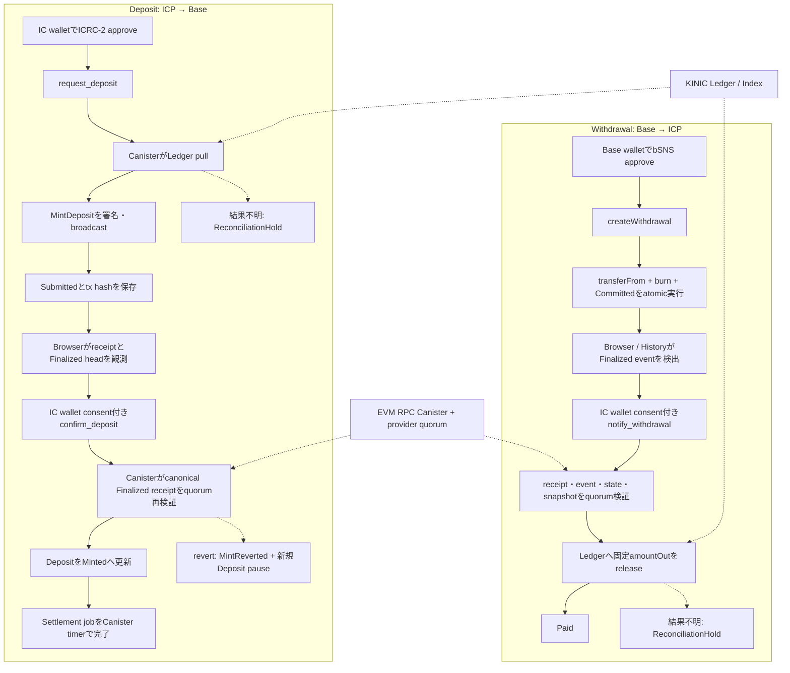

# KINIC–Base Bridge フロー

この文書は、現在の実装におけるICPとBase間のBridge処理を、利用者・UI・Canister・外部チェーンの境界から説明する。公開APIと状態の詳細は[Base Interface仕様](base-interface.md)、[Canister状態機械](canister-state-machine.md)、運用時の復旧手順は[operations runbook](runbooks/operations.md)を参照する。

## 登場するコンポーネント

| コンポーネント | 役割 |
|---|---|
| IC wallet（OISY / Plug） | ICRC-2 approve、`request_deposit`、`confirm_deposit`、`notify_withdrawal`の同意付き呼び出し |
| Base wallet | bSNS approveと`createWithdrawal`の署名 |
| Bridge canister | SQLite schema v17への状態保存、Ledger操作、EVM operation、Finalized再検証、Settlement job実行 |
| KINIC Ledger / Index | Depositのpull、Withdrawalのrelease、履歴照合 |
| EVM RPC Canister | 複数providerのquorumでBaseのcanonical Finalized chainを観測 |
| Base Bridge / bSNS | Deposit mint、Withdrawalのatomic transferFrom・burn・`Committed`記録 |
| Browser UI | wallet/runtimeの再検証、public Base RPCによるFinalized到達の観測、認証済みIC walletからの確認・通知開始 |

## 全体フロー



Finalized確認に失敗した場合、Safe head、固定confirmation数、単一RPCの結果へfallbackしない。quorumがcanonical block hashへ収束しない場合はfail closedとなる。

## Depositの詳細

1. UIはBase chain、Bridge runtime、CanisterのFinalized observation、Service Fee、ICRC Ledgerの残高・fee・allowance、Base recipientを直前に再検証する。必要なICRC-2 allowanceはgross amountとLedger feeを含む。
2. IC walletが`request_deposit`を呼ぶ。`owner_sequence`とpayloadからDeposit IDが決まり、同じsequenceの別payloadは拒否される。CanisterはFinalized Base snapshot、reserve、nonce、Ledger feeを確認し、Deposit recordとSettlement jobを保存する。
3. CanisterはICRC-2のpullを実行する。成功またはDuplicateなら`Escrowed`、確定的なLedger失敗なら`Cancelled`、結果不明なら`ReconciliationHold`になる。
4. `MintDeposit` operationを`Queued → Prepared → Submitted`へ進める。nonce割当、transaction envelope保存、threshold ECDSA署名、broadcastの各結果をstable stateへ保存する。Deposit mintのtransactionだけがCanister発EVM operationである。
5. `Submitted`のtransaction hashはCanisterに保存され、UIにも返される。UIは`settlement_id`、hash、owner、active deployment identifiersをlocalStorageへ保存し、表示中はpublic Base RPCを15秒間隔で確認する。秘密情報は保存しない。
6. receipt blockがFinalized head以下になったら、UIはIC walletの同意画面を表示して`confirm_deposit`を呼ぶ。Canisterは、受け取ったsettlement ID・transaction hash・receipt block・観測Finalized blockを保存値と照合する。
7. CanisterはEVM RPC Canisterのquorumからcanonical Finalized receiptを再取得し、成功なら`Minted`へ進める。receiptがrevertなら対象operationを`Reverted`、Depositを`MintReverted`へ遷移させ、新規Depositをpauseする。
8. 確認後のSettlementはstable job executorが進める。ブラウザを閉じても、Ledger側に残る処理はCanister timerで実行される。EVM confirmationそのものをtimerが代行することはない。

### Depositの停止・復旧

- Ledger結果不明: 同じtransfer identityでdedup期間内の照合を行い、その後はLedgerとIndexの完全なwatermark照合を進める。時間経過だけで取消しや再送を確定しない。
- EVM RPC、署名、nonce、reserveの停止: 自動再試行せず、原因解消後にowner、Governance、pause principalが`continue_deposit`を呼ぶ。
- Finalized revert: 自動再送しない。Governanceがreverted operation ID、Finalized Base state、Bridge signer、reserve、mint windowを再確認して`recover_mint_revert`を呼ぶ。replacement operationも同じconfirmation flowを通る。
- permanentな確認エラー: UIはpending recordをblockedとして保存し、Historyから明示的に再開する。

## Withdrawalの詳細

1. UIはBase wallet、送付先IC wallet、Service Fee、bSNS残高、chain/runtimeを直前に再検証する。bSNS allowanceは要求額ちょうどを許可する。
2. Base walletが`createWithdrawal(amount, maxServiceFee, owner, subaccount)`を呼ぶ。Contractは実行時Service Feeを固定し、次を同一transactionで行う。

   ```text
   transferFrom(caller, Bridge, amount)
   Bridge残高のburn(amount)
   WithdrawalCommitted(withdrawalId, ..., amountOut)
   ```

   `amountOut = amount - chargedServiceFee`であり、`Committed`はBase上の不可逆な終端状態である。
3. UIはBase walletが返したbroadcast transaction hashとIC ownerをpending confirmationとしてlocalStorageに保存する。保存に失敗しても送信失敗とは扱わずhashを表示する。Finalized receiptがrevertならpendingを削除し、成功した場合だけ後で`notify_withdrawal`を再開する。
4. Bridge pageのcoordinatorまたはHistoryがFinalized receiptと`WithdrawalCommitted` eventを検出すると、接続中のIC walletから`notify_withdrawal(transaction_hash)`を呼ぶ。ユーザーが通知を拒否した場合も、Historyの`Check and notify`から同じhashを明示再実行できる。
5. CanisterはEVM RPC quorumで同じFinalized block hashへreceipt、event、`getWithdrawal`、Bridge snapshotを束縛して検証する。requester、amount、Service Fee、amountOut、IC owner、subaccount、`Committed` statusが一致し、Bridge signerも期待値と一致しなければICP送金を始めない。
6. 検証後の状態は`Observed → ReleasePending → Paid`である。releaseは固定amountOutを固定IC Accountへ送り、BridgeがLedger feeを負担する。Ledger feeが確定済みService Feeを超えた場合はreleaseを作らずObserved recordを停止し、runtime fee guardと監査eventを残す。運用者は直ちにBase withdrawalをpauseし、fee設定を同期する。fee回復後は`continue_withdrawal`が同じrecordを再検証してからreleaseを開始する。
7. Ledger成功、Duplicate、履歴照合による成功確認で`Paid`になる。結果不明は`ReconciliationHold`へ移り、完全な不存在証拠を得たときだけ同じ金額・宛先の新しいtransfer identityで再開する。

Withdrawalには次の処理が存在しない。

- `confirm_withdrawal`などのEVM confirmation API
- Canister threshold ECDSAによるWithdrawal transaction
- Withdrawal後のBase refund、release acknowledgement、cancel
- Withdrawal IDからburnを取り消す専用refund/remint経路（Bridge Signerの通常Deposit mint権限は別のtrust assumption）

## UIとCanisterの自動進行境界

| 状態 | UIが行うこと | Canisterが行うこと |
|---|---|---|
| Deposit `Submitted` | public RPCでreceipt・Finalized headを観測し、IC walletから`confirm_deposit`を呼ぶ | transaction hashとconfirmation jobを保持し、confirmation証拠をquorumで再検証する |
| Deposit confirmation後 | Historyで状態を表示する | `phase = settlement`のjobをtimerでLedger・record終端まで進める |
| WithdrawalのBase burn後 | Finalized eventを探し、IC walletから`notify_withdrawal`を呼ぶ。通知hashをlocalStorageから再開する | receipt・event・state・snapshotをquorum検証し、Ledger releaseをjob化する |
| Ledger settlement中 | visibleなrecordのqueryと停止理由を表示する | timer、lease、同じtransfer identity、Reconciliation watermarkで進める |

ブラウザが閉じていると、DepositのSubmitted confirmationと未通知Withdrawalは自動では完了しない。次回UI起動、wallet再接続、またはHistoryの明示操作で再開する。Confirmation後にCanisterへ渡ったSettlementは、ブラウザなしでもtimerで継続する。

## 関連する公開API

- Deposit: `get_next_deposit_sequence` → `request_deposit` → `confirm_deposit` → 必要に応じて`continue_deposit`
- Withdrawal: Base `approve` → `createWithdrawal` → `notify_withdrawal` → 必要に応じて`continue_withdrawal`
- 状態照会: `get_deposit`、`get_withdrawal`、`get_withdrawals`、`get_bridge_status`
- Governance復旧: `recover_mint_revert`

詳細なphase、job、Reconciliation Holdの遷移は[docs/canister-state-machine.md](canister-state-machine.md)を、UIの実装前提は[ui/README.md](../ui/README.md)を参照する。
