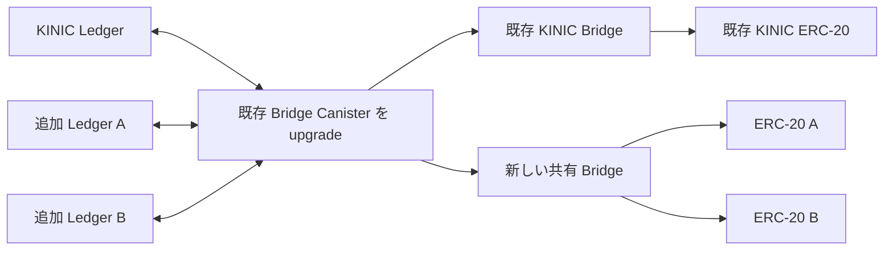

# Plan 009: 既存 Canister と Base の共有 Bridge による複数トークン対応

Status: IN PROGRESS — shared Base Bridge, schema v37 asset registry, and v36→v37 migration implemented; asset-specific Canister operation paths, UI, and deployment remain.
Updated: 2026-09-28, based on the user's request to extend the existing Canister, use one new Bridge with multiple ERC-20s, and preserve KINIC.

## 1. 今回の対象と構成

対象は IC ↔ Base の対応トークン追加。既存 Bridge Canister を upgrade し、複数の IC Ledger と Base ERC-20 の対応を管理する。他の EVM チェーンへの拡張は今回の対象から外す。

追加トークンは、**1つの新しい共有 Bridge コントラクトと、資産ごとの ERC-20** で扱う。トークンを追加するたびに Canister や Bridge を新規作成する旧 Plan 009 を、この計画で置き換える。

既存 KINIC ERC-20 は既存 Bridge だけに mint・burn を許し、そのアドレスは immutable。既存 Bridge の ERC-20 参照も immutable で、upgrade 経路はない。このため、KINIC のコントラクトとアドレスを維持する構成では、既存 KINIC 用 Bridge も残る。

実装上の根拠: [Bridge.sol](../contracts/src/Bridge.sol) の固定 `bsns` と token 生成、[BSNS.sol](../contracts/src/BSNS.sol) の固定 `bridge`、[config.rs](../canister/bridge-canister/src/config.rs) の単一 Ledger/Bridge 設定、[ledger.rs](../canister/bridge-canister/src/ledger.rs) の固定 fee、[profile.ts](../ui/src/config/profile.ts) の単一資産プロファイル。

矢印は接続関係を示す。通常の Base mint と withdrawal のトランザクションは従来どおりユーザーが送信する。

**構成上の仮定:** 「1つの Bridge」は追加トークンを集約する新 Bridge を意味する。Base 上の資産フロー用 Bridge は既存 KINIC 用を含めると計2つになる。KINIC まで共通のコントラクト入口に集約する要求がある場合は別途ルーター設計が必要で、それでも旧 Bridge への依存はなくならない。この仮定は契約仕様を確定する前に確認する。

## 2. 既存 KINIC の維持条件

- Canister ID、KINIC Ledger/Index、既存 Base Bridge/ERC-20/Timelock のアドレスを維持する。
- 既存 KINIC の署名鍵・派生パス、EIP-712 domain/type/digest、Base ABI/events、Deposit ID と owner sequence、Withdrawal ID の意味を維持する。
- KINIC の保管 Account/subaccount、transfer identity、memo、created_at_time、手数料確定値、残高、準備金、未完了処理、Hold、履歴を保存する。保管先変更や新しい transfer identity による再送を移行手段にしない。
- 発行済み Mint Authorization と未精算 Withdrawal を移行後も同じ対象に対して処理できることを検証する。
- 現在の認証済み IC 状態、Base runtime、配備物を回帰検証の基準にする。現在のソースが配備 bytecode と一致するとは仮定しない。
- ユーザーのトークン交換・送金や Canister reinstall を要求しない。メンテナンス時の admission 停止は、既存 Authorization の epoch 失効や精算継続への影響を含めて設計する。

既存 KINIC と新共有 Bridge は、登録済みの種類に基づく明示的な別接続として扱う。runtime 検証失敗時に別 ABI を試すフォールバックは設けない。未配備の新形式は呼び出し側・fixture と一緒に直接更新する。

## 3. 資産の識別と管理権限

資産を symbol では識別しない。共通の `asset_id` を定義し、Canister/deployment instance、IC Ledger、Base chain ID、Bridge、ERC-20、保管 Account、Index、decimals、接続種類を検証可能な登録情報として結び付ける。

新 Bridge の `asset_id`、Ledger binding、ERC-20、decimals、固定上限は登録後に変更・再利用できない。Ledger と登録 ID の重複も拒否する。削除して別トークンを同じ ID に割り当てる API は作らない。

追加は既存 Canister の共通 Governance を通す。新 Bridge 側でも Timelock を通じた型付きの資産登録を必要とし、一般ユーザーによる任意 Ledger/ERC-20 の登録は許可しない。計画上は既存 KINIC 用とは別の Timelock と役割鍵を新 Bridge に割り当てる。

共通 Canister の controller は全資産のコードと保管資産に権限を持つ。将来 KINIC SNS Root の単独管理に移る場合、追加資産もその権限に依存する。資産別の停止・会計は、この管理権限を分離しない。追加トークン側 SNS に独立した upgrade 権限があるとは表示・説明しない。

実装開始時に ADR 0010 の単一資産 Canister 方針と ADR 0008 の管理権限モデルを更新し、共通管理主体とその対象資産を明記する。今回は計画のみで、既存の本番運用ポリシーを変更しない。

## 4. 新しい Base Bridge の仕様案

新 Bridge は非 upgradeable とし、配備後にレビュー済みの資産を Timelock 経由で追加できる設計にする。将来の追加は資産登録と ERC-20 配備で完結させる。

| 項目 | 設計 |
|---|---|
| ERC-20 生成 | 登録処理で資産固有 name/symbol/decimals の ERC-20 を生成し、mint/burn 権限を新 Bridge に固定。登録と生成を同一トランザクションで完了 |
| Mint Authorization | 新しい domain/type を定義し、`asset_id` を署名対象に含める。chain ID、verifying contract、Deposit ID、recipient、金額、手数料、deadline、epoch も固定 |
| Replay 防止 | 処理済み判定を資産と Deposit ID に結び付け、他資産・既存 KINIC 用の署名を拒否 |
| Withdrawal | `asset_id` を入力・保存・イベント・照会結果に含め、その登録 ERC-20 のみ transferFrom/burn。ID は共有 Bridge 内で単調増加し、Canister は Bridge と ID の組で識別 |
| 手数料・上限 | Service Fee と上下限、Per-Deposit Limit、mint window・消費量を資産別に保持。上限と window 条件は登録時に固定 |
| 停止 | 資産別の Deposit/Withdrawal 停止と Bridge 全体の緊急停止。既に確定した債務の精算は継続 |
| Epoch | 資産別 epoch に加え、共有 signer 交代・全体停止で全資産の未使用署名を無効化する共通 epoch を署名に含める。全資産へのループ更新を避ける |
| 権限 | signer、Runtime Administrator、Timelock の分離と旧 signer 再利用禁止を維持。登録直後は停止状態で、認証済み binding 確認後に有効化 |
| Snapshot / イベント | 資産別 snapshot と登録イベントを設け、RPC とイベント処理をページ化。全資産走査が入出金の必須経路にならないようにする |

既存の mint の時間制約、user maximum fee、burn と Withdrawal 作成の原子性、確定 Withdrawal の不可逆性を引き継ぐ。新しい epoch の組合せ、署名形式、role 権限表と registration calldata を Solidity 実装前に仕様・テストベクトルで固定する。

## 5. 既存 Canister の拡張

### 資産別の状態と保管

- 共通設定と資産設定を分離し、Ledger/Index、Base binding、Ledger fee policy、会計・準備金・quota・pause・履歴を資産に結び付ける。
- 新資産の保管には、同じ Canister が所有する資産別 subaccount を使う。既存 KINIC Account はそのまま登録する。Ledger を跨ぐ金額の合算や担保流用を禁止する。
- Deposit、funding attempt、Withdrawal、Hold、fee payout、job、audit、各 index に資産と接続先を確定時から保持する。外部 await の後に画面選択や可変の既定値から接続先を再解決しない。
- `asset_id`、処理 ID、lease generation、dispatch identity、設定 revision を callback 検証に含める。再試行・再起動・upgrade でも送金先 Ledger と元の transfer identity を変えない。
- KINIC の既存 API は明示的に KINIC を扱う入口として維持し、新 API は資産を明示する。旧 API から「現在選択中の資産」へ転送しない。

### Ledger と費用

- 対象 Ledger ごとに ICRC-2 pull、ICRC-1 release/refund、Duplicate、archive、Index の対応を確認する。ICRC 対応という表示だけで現在の `get_transactions`/Index による照合が可能とは判断しない。
- 最初の追加対象は既存の精算・履歴照合を適用できる Ledger とし、不適合 Ledger は別アダプターの設計対象として明示する。
- IC と Base の decimals を一致させ、単位変換・丸めを導入しない。8桁固定を廃止し、金額の u128 範囲を検証する。
- 新資産の Ledger fee はレビュー済みの資産別ポリシーとし、送信前に記録へ固定する。BadFee や fee policy 変更で曖昧な transfer を新 identity として送信しない。
- fee 変更時は新規 admission と確定済み処理を分けて扱う。既存 identity の再照合、確定失敗、完全な不在証明の条件を仕様化してから再試行を実装する。KINIC の既存確定額を再計算しない。
- cycles、実行時間、Canister upgrade、共有 signer は共通の障害範囲になる。資産別 quota・公平な job 選択・全体 cycles floor を設け、1資産の失敗や大量リクエストによる他資産の精算妨害を検証する。

### Base 接続と Governance

既存 KINIC binding と新共有 Bridge binding を認証済み設定で選択し、runtime・token/Bridge 相互参照・署名・receipt・event を同じ資産に固定する。新資産登録の中断後も同じ登録を照合して再開できる状態機械を設ける。

登録は「IC 側で準備 → Timelock による Base 配備・登録 → Finalized 登録内容と runtime の照合 → IC binding 確定 → 有効化」の順序とする。片側だけ準備できた状態では資金を受け付けない。登録 digest と operation ID を両側で検証し、他の登録の receipt を流用しない。

クロスチェーンの有効化は原子的にできない。IC の binding と Withdrawal 支払処理を利用可能にし、新規 Deposit は閉じたまま Base を有効化する。Base の有効化を Finalized で確認した後に IC の Deposit admission を開く。途中で処理が止まっても、Base 有効化後の burn に対応する債務は受け入れて精算できることを必須とする。片側の停止・通信障害を理由に確定債務を削除しない。

Governance トランザクションの nonce は `(chain ID, sender)` ごとに管理する。資産別に同じ EOA の nonce lane を複製しない。新 Bridge の鍵は既存 KINIC の派生パスと分離し、役割ごとの鍵も分ける。RPC は Base 固定の既存信頼モデルを維持する。

## 6. Stable state と本番への移行

開始点は配備済み schema v36 / record wire v30。新しい資産 registry を追加する schema v37 へ一度だけ原子的に移行する。旧計画にあった「本番 v35」は移行判断に使用しない。事前に認証済みの現在状態で開始点を確認する。

多資産の registry と binding 索引を追加するため schema を v37 に上げ、既存レコード本体の wire は v30 のまま維持する。現在の本番ポリシーは v36 以外を拒否するので、Canister だけを先に変更せず、対応するポリシー・検証器・UI・運用 driver を同じリリースで更新する。複数版を無条件に許す緩和はしない。

移行テストは空 DB に加え、発行済み署名、funding attempt、返金中、Withdrawal 支払い中、Hold、fee payout、Governance pending、履歴索引を含む本番相当の状態で行う。既存行を KINIC に対応付け、ID・送金 identity・残高・会計・署名を前後比較する。

移行処理の原子性と instruction/memory 制限内への収まりを測定する。収まらない場合は admission を停止して進める明示的な移行状態機械を先に設計し、部分移行を通常運転として公開しない。旧 Wasm が新 schema を開けるとは仮定せず、障害時は資金保全と修正版への forward upgrade を基本にする。

本番手順は、基準状態取得、完全検証と再現ビルド、停止と未完了処理の確認、認証済みの直前 module/controller 再確認、upgrade、移行・履歴・binding の検証、対応 UI の公開、追加資産の段階的有効化とする。実際の認証状態に応じた実行権限を使用する。

現行 driver が要求する Activated/unpaused 条件と計画停止の順序は、移行用 driver の仕様で整合させる。停止を含む承認対象状態と直前状態を厳密に拘束し、現行 gate を手動で迂回しない。

## 7. UI と運用ツール

資産選択で1つの検証済み binding を選ぶ。残高・allowance・approve・送金・履歴・復旧は選択資産に固定する。ネットワークは今回 Base のみ。

query cache、localStorage、復旧 worker、URL、履歴照会と署名待ち処理に資産/接続の識別を加える。画面切替後に前資産の応答が到着しても、新資産への送金や通知を開始しない。既存 KINIC の保存済み履歴・復旧データは意味を変えず読めるようにする。

`tools/bridge-profile`、release manifest、deploy/upgrade/activation driver と UI 公開 gate を更新する。KINIC 固定チェックを単に削除せず、共通 Canister の認証と資産別の registry/runtime/fee/decimals/history 認証に置き換える。未登録資産、偽プロファイル、混在 revision、別資産の証拠を拒否する。

## 8. 実装の順序と完了条件

| 段階 | 成果物 | 完了条件 |
|---|---|---|
| 1. 基準と設計 | 配備物と状態の基準、更新 ADR、資産 ID、権限表、schema 移行仕様、ABI/EIP-712 案 | KINIC 維持条件、共通管理主体、最初の追加 Ledger と fee policy を確定 |
| 2. Base | 新共有 Bridge、登録・ERC-20 生成、資産別制限/停止、署名・イベント | 2種類以上のテスト資産で入出金、他資産署名・receipt の拒否、role/epoch/原子性テストと該当証明を通過 |
| 3. Canister | registry、移行、資産別会計/API/job、2種類の Base 接続 | 本番相当 v36 fixture から移行し、既存 KINIC の処理と新資産の並行処理を検証 |
| 4. 統合と UI | プロファイル、公開 gate、登録 driver、UI/復旧 worker | 切替中の非同期処理、同じ数値 ID、登録中断、履歴・残高・精算の分離を E2E で検証 |
| 5. Staging | IC テスト環境と Base Sepolia、旧 KINIC 形式1組＋新共有 Bridge/2トークン | 実際の配備物で登録・入出金・返金・Hold・upgrade・停止/再開を再現 |
| 6. 本番リリース | 再現 Wasm、完全 proof receipt、認証済み移行手順、配備・UI 証拠 | 現在状態に拘束された upgrade と追加契約配備を実施し、最初の追加資産を検証後に有効化 |

段階2と3は仕様を共有するが、同じ checkout への変更は1 writer にする。既存 KINIC の署名形式を保つ必要があるため、新共有 Bridge の ABI を既存 ABI に上書きしない。

## 9. 証明・テストの対象

変更前に [proof-impact.tsv](../verification/proof-impact.tsv) と [claims.tsv](../verification/claims.tsv) から詳細な影響表を作る。主要な既存 claim 候補は次のとおり。

| 対象 | Claim IDs |
|---|---|
| 資産・署名・replay | `authorization_binding`, `payment_identity`, `deposit_identity_preflight`, `ledger_block_provenance`, `epoch_invalidation` |
| 会計・準備金・精算 | `deposit_backing`, `settlement_backing`, `reservation_commit`, `reservation_lifecycle`, `committed_quote`, `fee_accounting_once`, `fee_payout`, `hold_resolution` |
| admission・履歴 | `deposit_admission`, `withdrawal_admission_boundary`, `withdrawal_finalization`, `exact_mint_finalization`, `refund_evidence_enforcement`, `nonterminal_deposit_index_consistency` |
| job・共通資源 | `lease_lane_isolation`, `lease_outcome`, `notification_quota_isolation`, `signing_cycle_reserve`, `paid_call_cycle_reserve` |
| 登録・運用権限 | `activation_preflight`, `operational_config_seal`, `governance_nonce_chain_binding`, `governance_confirmation_authorization`, `confirmed_activation_evidence_binding` |

新しい主張として、資産間の担保非流用、登録 binding の不変性、資産横断 replay の拒否、移行による既存債務・identity 保存、共通/資産別 epoch の整合性を登録する。各 claim の抽象定理、production kernel、proof obligation、negative fixture、refinement/adapter test、transaction test、vector consumer、外部仮定を紐付ける。

最低限の受け入れ例:

- A の署名・receipt・Ledger block・同じ数値の Withdrawal ID を B に使っても送金しない。
- A の残高・fee reserve・pending liability を変更しても B と KINIC の裏付けは変化しない。
- A の停止・Hold・履歴照合失敗で B の設定は変わらず、精算用の共通資源配分を検証できる。
- 資産別停止と共有 signer 交代/全体停止で、無効化すべき署名だけが仕様どおり無効化される。
- fee 変更、応答喪失、callback 重複、再起動、upgrade の後も二重送金しない。
- 8桁と異なる桁数、同じ symbol、上限値、未登録資産、既存 KINIC 署名、画面切替を検証する。
- Base 登録だけ成功、IC binding 確定だけ中断した状態では admission を閉じ、同じ登録として再開する。Base 有効化後の中断では、既に burn された債務を受け入れて精算する。

実装 PR は manifest 検証と `scripts/ci-local.sh proofs-impacted <changed-paths.json>`、該当 unit/negative/refinement/transaction テストを通す。UI は Playwright で確認する。release candidate/main は `scripts/ci-local.sh all`、production driver は完全な current-source receipt を伴う `scripts/ci-local.sh proofs` と2回の再現ビルドを要求する。AGENTS.md の環境事前確認、1 writer、入力凍結、長時間実行の手順に従う。

Ledger の動作・履歴の完全性、IC と Base の確定性、RPC provider の信頼、暗号、共通 Governance/controller、実行資源の可用性は外部仮定として残る。形式証明で保証できない境界は `partial` のまま明記する。

## 10. 実装前に確定する項目

1. 既存 KINIC Bridge を残し、新しい1つの共有 Bridge に追加トークンを集約する構成。
2. 最初の追加トークンの Ledger/Index、decimals、fee、必要な履歴 API とテスト資産。
3. 共通 Canister の Governance/controller 方針と、追加トークン側が依存する管理主体。
4. 資産登録数、資産別上限、quota、共有 cycles 予算、登録 Timelock と緊急停止手順。
5. schema v37 / record wire v30 の移行処理時間、本番停止時間、障害時の復旧手順。

共有 Bridge と資産別 ERC-20 生成、資産別 fee/limit/pause/epoch、Canister の資産 registry、履歴 binding、v36→v37 移行まで実装済み。新資産の Canister 入出金経路、UI、live 状態の認証、完全な証明実行、契約配備、Canister upgrade は未実施。
